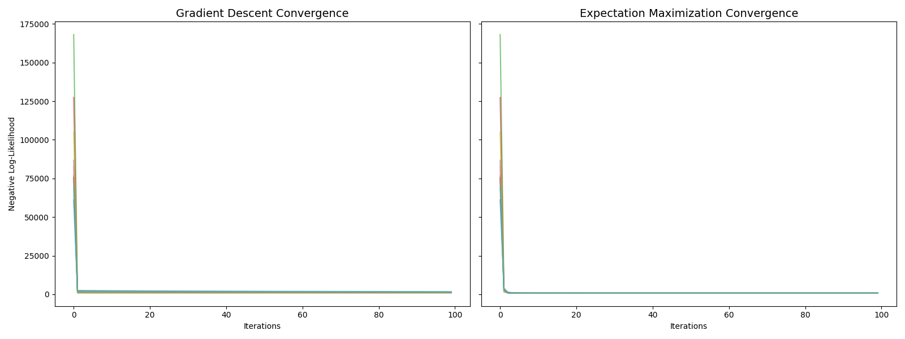

# Factor Analysis: GD vs. EM Optimization

This module implements **Factor Analysis (FA)**, a generative latent variable model, and compares two primary optimization strategies: **Gradient Descent** and **Expectation Maximization**.

## 🧠 Mathematical Derivations

This module includes complete proofs for:
*   **Matrix Lemma:** $\frac{\partial f(X^T X)}{\partial X} = 2X \frac{\partial f(X^T X)}{\partial (X^T X)}$.
*   **Gradients of the NLL:** Derived the gradients for the loading matrix $U$ and noise covariance $\Psi$ with respect to the negative log-likelihood.
*   **Efficient Inversion:** Implementation of the **Woodbury Matrix Identity** to reduce computational complexity from $O(m^3)$ to $O(m \cdot l^2)$, where $m$ is the number of features and $l$ is the number of factors.

## ⚙️ Algorithms

### 1. Gradient Descent (GD)
Utilizes the derived matrix gradients to minimize the NLL directly. While conceptually simpler, it is highly sensitive to the choice of learning rate.

### 2. Expectation Maximization (EM)
Iteratively estimates the latent factors (E-step) and updates the model parameters (M-step). EM typically shows significantly faster and more stable convergence compared to GD in the context of Gaussian latent models.

## 📊 Performance Benchmark

The following plot demonstrates the convergence of 10 different random initializations for both algorithms. 

**Observation:** EM achieves the global minimum significantly faster (usually within < 10 steps) and is more robust to initialization than standard Gradient Descent.

