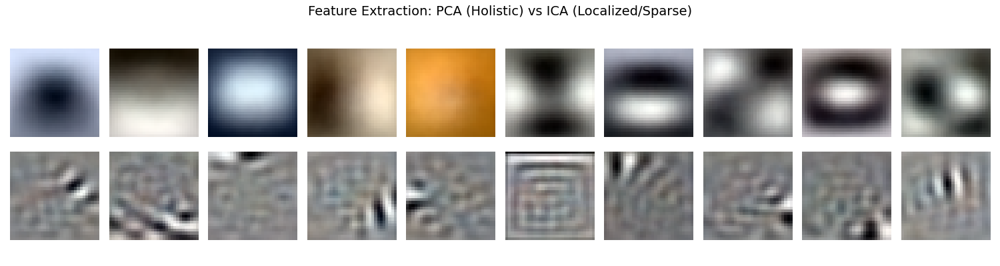
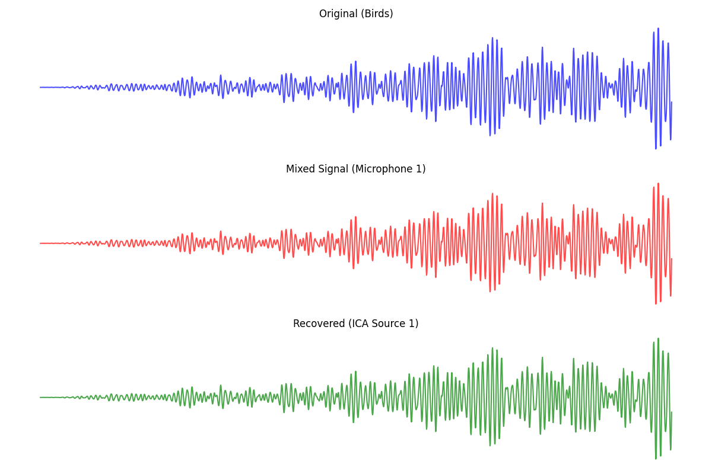

# Independent Component Analysis (ICA)

This module explores the statistical foundations of **Independent Component Analysis (ICA)** and its practical applications in image feature extraction and audio signal separation (Blind Source Separation).

## 🧠 Theoretical Foundations

This module includes the mathematical derivation and proofs for:
*   **Cumulant Generating Functions:** Proof of additivity $\kappa_n(X + Y) = \kappa_n(X) + \kappa_n(Y)$ and scaling $\kappa_n(\alpha X) = \alpha^n \kappa_n(X)$ for independent variables.
*   **Central Limit Theorem & Non-Gaussianity:** Demonstrating why the sum of independent variables tends toward a Gaussian distribution, and how maximizing non-Gaussianity (Kurtosis) allows for the recovery of original sources.
*   **Moments of Normal Distributions:** Derived recurrence relations for higher-order moments of standard normal variables to determine their third and fourth cumulants.

## 🖼️ Feature Extraction: PCA vs. ICA (CIFAR-10)

Using the **CIFAR-10** dataset (32x32 color images), we compared how different decomposition methods "see" the data:
*   **PCA (Descriptive/Holistic):** Captures global variance. The components appear as blurry "eigen-blobs" representing the average distribution of color and light.
*   **ICA (Generative/Sparse):** Maximizes statistical independence. The components appear as localized **Gabor-like filters**, capturing sharp edges, textures, and specific orientations—mimicking the early visual processing in the human primary visual cortex.

## 🎙️ The Cocktail Party Problem (Blind Source Separation)

We simulated a real-world signal processing challenge by mixing three distinct audio sources:
1.  **Birds** (Rhythmic/High Frequency)
2.  **Ocean** (Ambient/Continuous)
3.  **Frogs** (Pulsed/Low Frequency)

Using the **FastICA** algorithm, we successfully separated these interleaved signals from a $3 \times 3$ linear mixture, recovering the original waveforms with high fidelity.

## 📊 Visual Results

### 1. PCA vs ICA Components

*Top: PCA holistic blobs. Bottom: ICA localized edge filters.*

### 2. Audio Source Recovery

*Comparison between the original source, the messy mixture, and the cleaned ICA recovery.*

---
**Implementation Note:** All algorithms were implemented using a modular approach, separating the statistical `engine.py` from the experimentation `analysis.py`.
