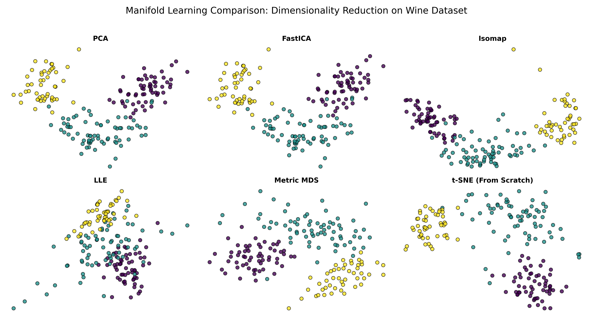

# Manifold Learning & Scaling (t-SNE from Scratch)

This module focuses on non-linear dimensionality reduction and manifold learning. The core contribution is a from-scratch implementation of **t-SNE** and a comparative benchmark against five other scaling algorithms.

## 🌀 t-SNE Implementation from Scratch

Unlike standard linear projections, t-SNE preserves local neighborhood structures by matching probability distributions in high and low-dimensional spaces. 

**Key Features implemented:**
*   **Perplexity Calibration:** Automated binary search to find the optimal Gaussian kernel width ($\sigma_i$) for every data point to match a target perplexity.
*   **Student t-Distribution:** Utilized a heavy-tailed Student t-distribution with one degree of freedom in the low-dimensional space to effectively resolve the **"Crowding Problem"**.
*   **KL-Divergence Gradient:** Manually derived and implemented the gradient descent optimization for the cost function $C = KL(P||Q)$.

## 🧪 Benchmarking on the Wine Dataset

We applied the from-scratch t-SNE alongside 5 standard algorithms to the **UCI Wine Dataset** (178 samples, 13 chemical features) to evaluate cluster separation quality.

1.  **PCA & FastICA:** Captured global spread but resulted in significant class overlap due to linear constraints.
2.  **Metric MDS:** Preserved global Euclidean distances; performed similarly to PCA.
3.  **Isomap:** Captured the non-linear "arc" of the data by preserving geodesic distances.
4.  **LLE:** Attempted to preserve local linear relationships, resulting in a distinct "stringy" manifold structure.
5.  **t-SNE (Winner):** Achieved the most distinct and well-separated clusters by successfully managing the trade-off between local and global structure.

## 📊 Visual Comparison

---
**Technical Note:** To satisfy the latest `Scikit-Learn` requirements, the MDS implementation utilizes `metric_mds=True` and explicit initialization parameters to ensure numerical stability and reproducibility.
