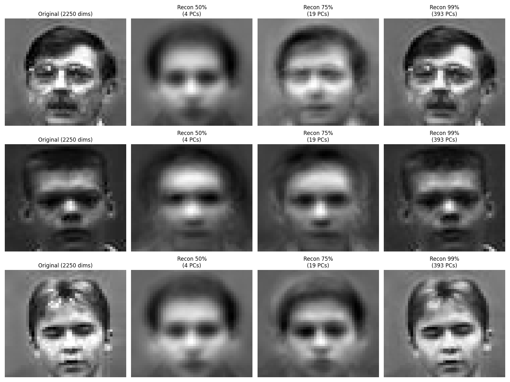
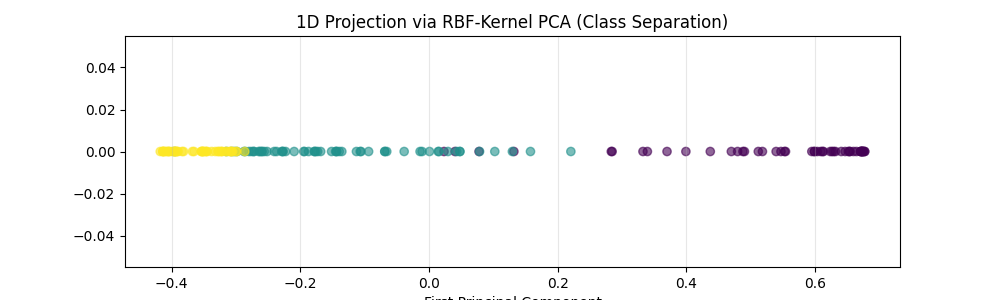

# PCA Compression & Kernel Manifolds

This module explores the dual nature of Principal Component Analysis: as a tool for lossy data compression and as a basis for non-linear manifold learning via Kernels.

## 🧠 Theoretical Proofs
*   **Positive Semi-Definiteness:** Mathematically proved that the covariance matrix $\mathbf{C} = \frac{1}{n}\mathbf{X}^T\mathbf{X}$ is positive semi-definite.
*   **Eigenvalue Significance:** Proved that $\lambda \ge 0$ for all components, ensuring that variance is a physically meaningful, non-negative quantity used to rank features.

## 🖼️ Image Compression (Eigenfaces)
Using the `faces94` dataset (45x50 pixels), we analyzed the trade-off between the compression ratio and reconstruction fidelity.
*   **50% Variance:** Reduces 2250 dimensions to ~4-6 components while maintaining the global facial structure.
*   **99% Variance:** Achieves high-fidelity reconstruction, capturing fine details like glasses and skin textures.

## 🌀 Non-Linear PCA (The Kernel Trick)
Standard PCA fails on concentric or non-linearly separable data. By applying an **RBF Kernel** ($\gamma=0.25$), we project the data into a high-dimensional space where the circular structure is "unrolled" into a linearly separable 1D space.

**Key Finding:** Kernel PCA demonstrates that high-dimensional mappings can resolve complex manifolds that appear inseparable in 2D Euclidean space.
