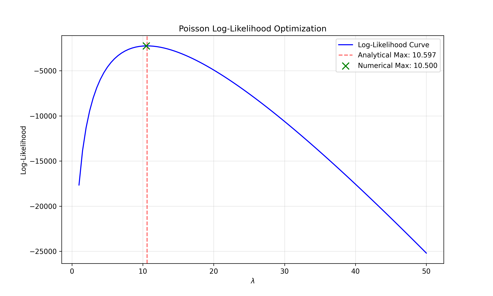

# Poisson Likelihood Optimization

This module focuses on the derivation and implementation of the Maximum Likelihood Estimator (MLE) for the Poisson distribution. It demonstrates the intersection of calculus-based optimization and numerical grid-search methods.

## 📈 Mathematical Foundation
The Poisson distribution is used to model the probability of a given number of events occurring in a fixed interval. The Likelihood function $\mathcal{L}(\lambda)$ for $n$ i.i.d. samples is:

$$\mathcal{L}(\lambda) = \prod_{i=1}^{n} \frac{e^{-\lambda} \lambda^{x_i}}{x_i!}$$

Through logarithmic transformation (Log-Likelihood) and finding the critical point where the derivative equals zero, we derive the analytical solution:
$$\hat{\lambda} = \frac{1}{n} \sum_{i=1}^{n} x_i$$

## 📊 Visual Analysis
The plot below visualizes the concave nature of the log-likelihood surface. The overlap of the red dashed line (Analytical) and the green marker (Numerical) validates the mathematical derivation.

## 🔢 Comparative Results
The implementation was tested against a dataset of $N=1000$ samples:

| Method | Estimated $\lambda$ | Log-Likelihood Value |
| :--- | :--- | :--- |
| **Analytical (Formula)** | 10.597 | -2239.405 |
| **Numerical (Grid Search)** | 10.500 | -2239.852 |

**Conclusion:** The convergence of both methods confirms that the sample mean is the optimal unbiased estimator for the Poisson rate parameter.
