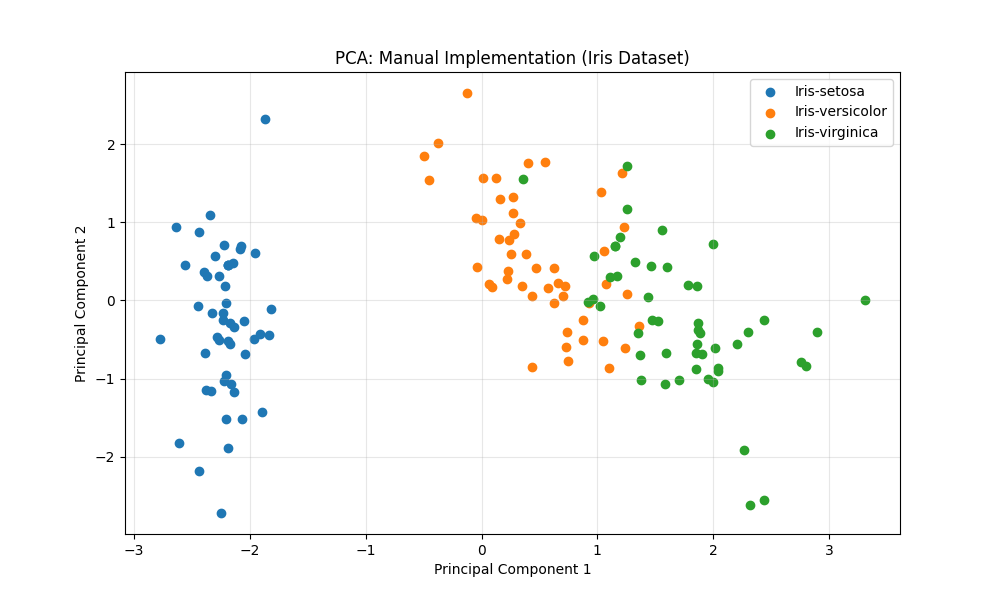

# Principal Component Analysis (PCA)

This module implements the PCA algorithm from scratch to perform dimensionality reduction on the Iris dataset. It explores the relationship between eigendecomposition and feature variance.

## 📈 Methodology
PCA identifies the directions (principal components) that maximize the variance in a dataset. The process involves:
1. **Standardization:** Scaling data to have zero mean and unit variance.
2. **Covariance Matrix:** Computing the correlation between feature dimensions.
3. **Eigendecomposition:** Extracting Eigenvectors (directions) and Eigenvalues (magnitude of variance).
4. **Projection:** Transforming the original 4D space into a 2D subspace.

## 📊 Results: Explained Variance
The first two principal components capture the vast majority of the information:
*   **PC1:** 72.77% of variance
*   **PC2:** 23.03% of variance
*   **Total:** 95.80% of information preserved in 2D.

## 🖼️ Visualization
The down-projected data shows clear separation between flower classes (Setosa, Versicolor, and Virginica) using only the first two principal components.

## 🛠️ Validation
Results were benchmarked against `scikit-learn.decomposition.PCA`. The self-implemented matrix $\mathbf{Y}$ matches the library output exactly (up to an arbitrary axis flip), confirming the mathematical validity of the covariance-based approach.
